---
## Front matter
lang: ru-RU
title: Структура научной презентации
subtitle: Простейший шаблон
author:
  - Кулябов Д. С.
institute:
  - Российский университет дружбы народов, Москва, Россия
  - Объединённый институт ядерных исследований, Дубна, Россия
date: 01 января 1970

## i18n babel
babel-lang: russian
babel-otherlangs: english

## Formatting pdf
toc: false
toc-title: Содержание
slide_level: 2
aspectratio: 169
section-titles: true
theme: metropolis
header-includes:
 - \metroset{progressbar=frametitle,sectionpage=progressbar,numbering=fraction}

## Fonts
mainfont: IBM Plex Serif
romanfont: IBM Plex Serif
sansfont: IBM Plex Sans
monofont: IBM Plex Mono
mathfont: STIX Two Math
mainfontoptions: Ligatures=Common,Ligatures=TeX,Scale=0.94
romanfontoptions: Ligatures=Common,Ligatures=TeX,Scale=0.94
sansfontoptions: Ligatures=Common,Ligatures=TeX,Scale=MatchLowercase,Scale=0.94
monofontoptions: Scale=MatchLowercase,Scale=0.94,FakeStretch=0.9
mathfontoptions:

---

# Информация

## Докладчик

:::::::::::::: {.columns align=center}
::: {.column width="70%"}

  * Казначеев Сергей Ильич 
  * Студент
  * Российский университет дружбы народов
  * [1132240693@pfur.ru]

:::
::: {.column width="30%"}

:::
::::::::::::::

## Цель

Целью данной работы является приобретение практических навыков установки операционной системы на виртуальную машину, настройки минимально необходимых для дальнейшей работы сервисов.

## Задание

Установка операционной системы 
Установка драйверов для VirtualBox
Настройка раскладки клавиатуры
Установка имени пользователя и название хоста 
Установка программного обеспечения для создания документации
Домашнее задание

## Установка Fedora Sway

Для начала создаем виртуальную машину

## Установка Fedora Sway

Далее выделяем память и количество ядер процессора

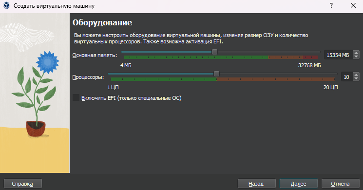

## Установка Fedora Sway

Выделяем виртуальный диск размером 80гб

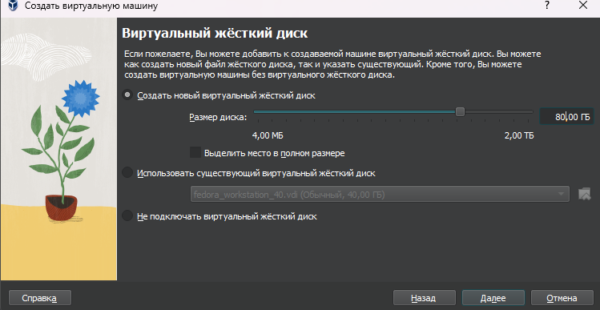
## Установка Fedora Sway

После чего включаем 3D ускорение

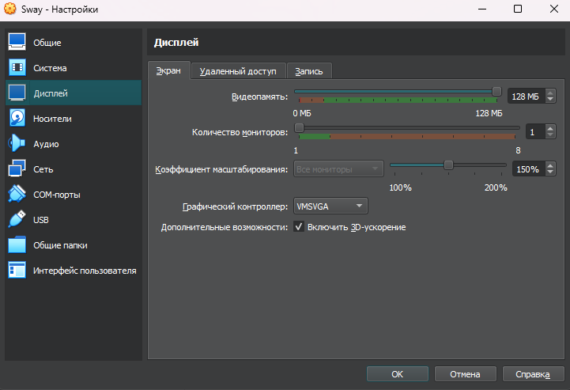

## Установка Fedora Sway

После установки запускаем виртуальную машину и запустим liveinst

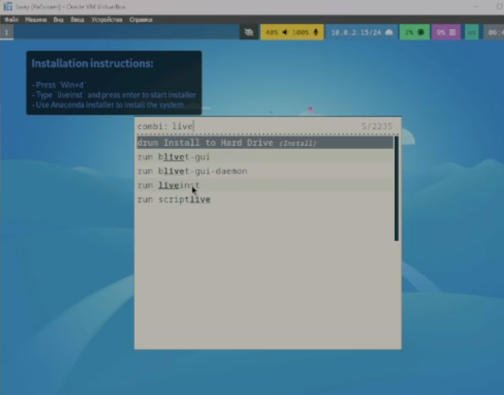

## Установка Fedora Sway

Далее выбираем язык

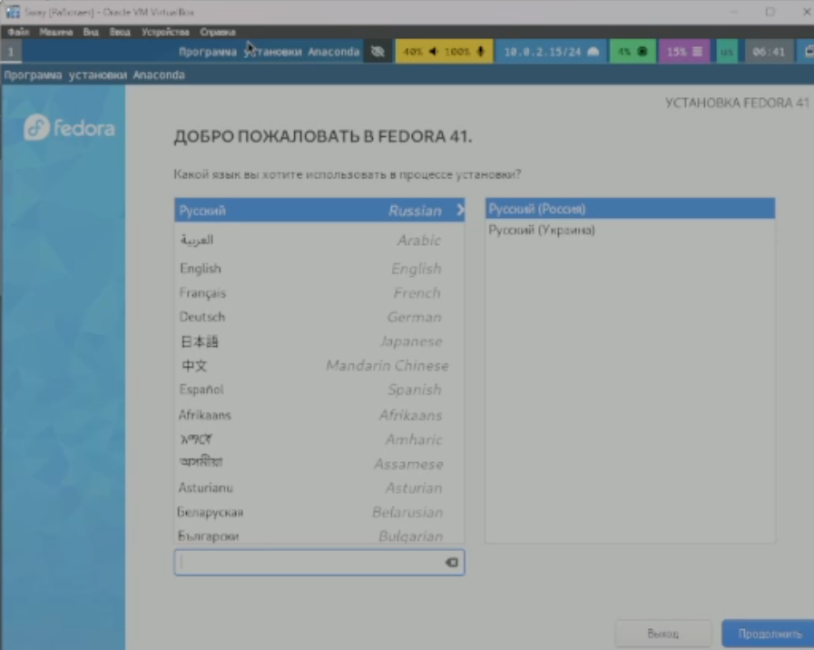

## Установка Fedora Sway

Указываем диск для установки

## Установка Fedora Sway

Включаем root пользователя и укажем для него пароль

## Установка Fedora Sway

Создаем свою учетную запись 

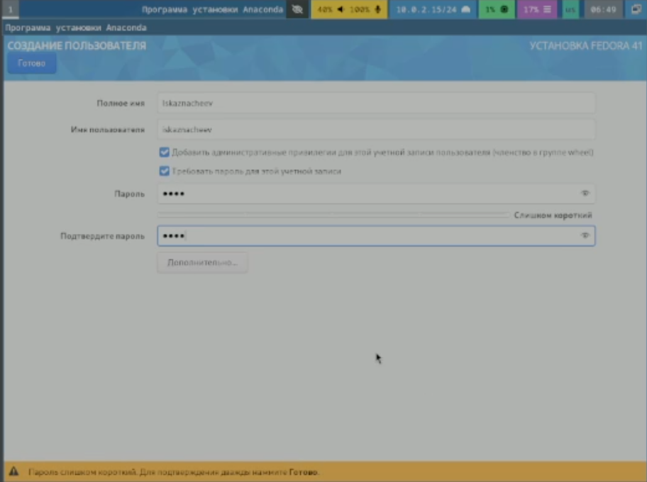
## Установка Fedora Sway

После чего мы можем изъять загрузочный диск

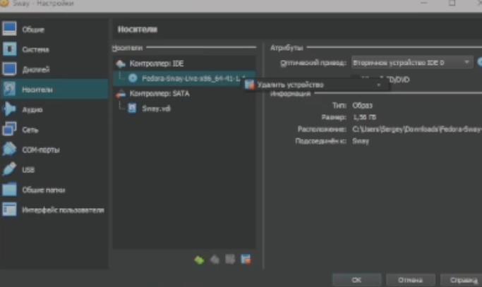

## Переход в режим супер пользователя 

Переходим в режим супер пользователя 

## Обновление всех пакетов  

Далее обновим все пакеты

## Установка нужных пакетов 

Далее устанавливаем mc и tmux

## Включение автообновления

Устанавливаем dnf-automatic

## Отключение Selinux

Отклучим Selinux

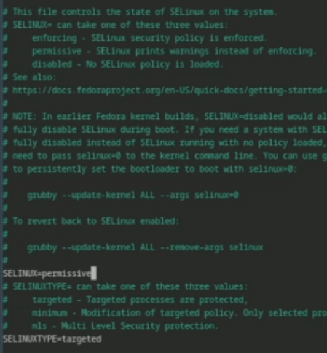

## Установка драйверов VirtualBox

Устанавливаем tmux

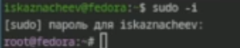

## Настройка раскладки клавиатуры

Создаем файл

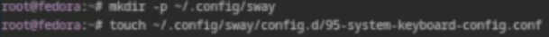

## Настройка раскладки клавиатуры

Втавляем код который предложен в лабораторной работе

## Устанавливаем название хоста 

Теперь поменяем название хоста согласно лабораторной работы 

## Устанавливка Pandoc

Устанавливаем pandoc

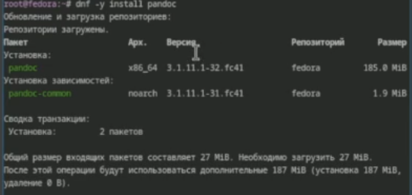

## Устанавливка программного обеспечения

Скачиваем pandoc-crossref и распаковываем его

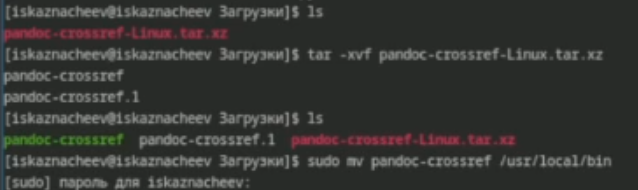

## Устанавливка программного обеспечения для создания документации 

Устанавливаем texlive

## Домашнее Задание

Теперь с помощью команды dmesg получим следующую  информацию 

1)Версия ядра Linux 6.12.13
2)Частота процессора 3686
3)Модель процессора (CPU0) Core i5-12600KF
4)Объём доступной оперативной памяти 16
5)Тип обнаруженного гипервизора KVM

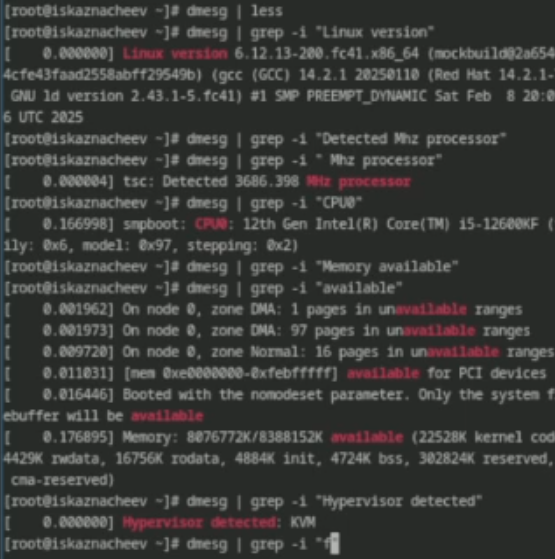

## Домашнее Задание

Тип файловой системы корневого раздела-BTRFS Последовательность монтирования файловых систем BTRFS(sda3) и EXT4-fs

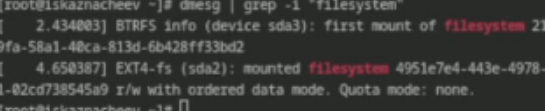

## Вывод
Я приобрел практические навыки установив операционную систему на виртуальную машину и натроил ее для дальнейшей работы

:::

