---
## Front matter
title: "Лабораторная работа №6"
subtitle: "Отчет"
author: "Казначеев Сергей Ильич"

## Generic otions
lang: ru-RU
toc-title: "Содержание"

## Bibliography
bibliography: bib/cite.bib
csl: pandoc/csl/gost-r-7-0-5-2008-numeric.csl

## Pdf output format
toc: true # Table of contents
toc-depth: 2
lof: true # List of figures
lot: true # List of tables
fontsize: 12pt
linestretch: 1.5
papersize: a4
documentclass: scrreprt
## I18n polyglossia
polyglossia-lang:
  name: russian
  options:
	- spelling=modern
	- babelshorthands=true
polyglossia-otherlangs:
  name: english
## I18n babel
babel-lang: russian
babel-otherlangs: english
## Fonts
mainfont: IBM Plex Serif
romanfont: IBM Plex Serif
sansfont: IBM Plex Sans
monofont: IBM Plex Mono
mathfont: STIX Two Math
mainfontoptions: Ligatures=Common,Ligatures=TeX,Scale=0.94
romanfontoptions: Ligatures=Common,Ligatures=TeX,Scale=0.94
sansfontoptions: Ligatures=Common,Ligatures=TeX,Scale=MatchLowercase,Scale=0.94
monofontoptions: Scale=MatchLowercase,Scale=0.94,FakeStretch=0.9
mathfontoptions:
## Biblatex
biblatex: true
biblio-style: "gost-numeric"
biblatexoptions:
  - parentracker=true
  - backend=biber
  - hyperref=auto
  - language=auto
  - autolang=other*
  - citestyle=gost-numeric
## Pandoc-crossref LaTeX customization
figureTitle: "Рис."
tableTitle: "Таблица"
listingTitle: "Листинг"
lofTitle: "Список иллюстраций"
lotTitle: "Список таблиц"
lolTitle: "Листинги"
## Misc options
indent: true
header-includes:
  - \usepackage{indentfirst}
  - \usepackage{float} # keep figures where there are in the text
  - \floatplacement{figure}{H} # keep figures where there are in the text
---

# Цель работы

Приобрести практические навыки взаимодействия пользователя с системой посредством командной строки 

# Задание

1 Определите полное имя вашего домашнего каталога. Далее относительно этого ката-
лога будут выполняться последующие упражнения.
2 Выполните следующие действия:
 2.1. Перейдите в каталог /tmp.
 2.2. Выведите на экран содержимое каталога /tmp. Для    этого используйте команду ls
 с различными опциями. Поясните разницу в выводимой на экран информации.
 2.3. Определите, есть ли в каталоге /var/spool подкаталог с именем cron?
 2.4. Перейдите в Ваш домашний каталог и выведите на   экран его содержимое. Опре-
 делите, кто является владельцем файлов и подкаталогов?

Выполните следующие действия:
 3.1. В домашнем каталоге создайте новый каталог с именем newdir.
 3.2. В каталоге ~/newdir создайте новый каталог с именем morefun.
 3.3. В домашнем каталоге создайте одной командой три новых каталога с именами
letters, memos, misk. Затем удалите эти каталоги одной командой.
 3.4. Попробуйте удалить ранее созданный каталог ~/newdir командой rm. Проверьте,
был ли каталог удалён.
 3.5. Удалите каталог ~/newdir/morefun из домашнего каталога. Проверьте, был ли
каталог удалён.

4 С помощью команды man определите, какую опцию команды ls нужно использо-
вать для просмотра содержимое не только указанного каталога, но и подкаталогов,
входящих в него.
5 С помощью команды man определите набор опций команды ls, позволяющий отсорти-
ровать по времени последнего изменения выводимый список содержимого каталога
с развёрнутым описанием файлов.
6 Используйте команду man для просмотра описания следующих команд: cd, pwd, mkdir,
rmdir, rm. Поясните основные опции этих команд.
7 Используя информацию, полученную при помощи команды history, выполните мо-
дификацию и исполнение нескольких команд из буфера команд.

# Выполнение лабораторной работы

Для начала посмотрим полный путь для нашего каталога 

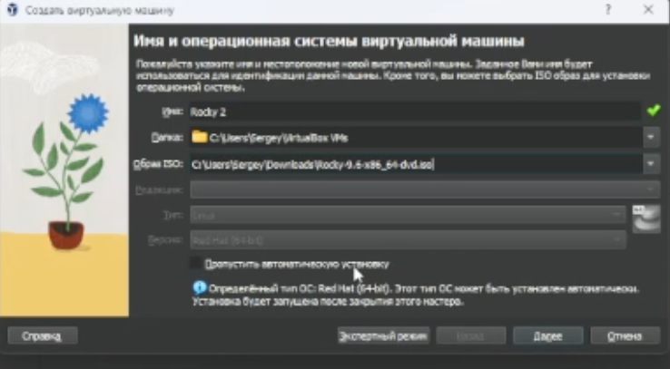

Далее перейдем в каталог /tmp и посмотрим его 

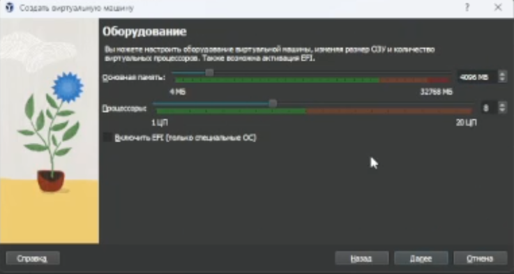

С помощью ключа -а выведем и дополнительные файлы 

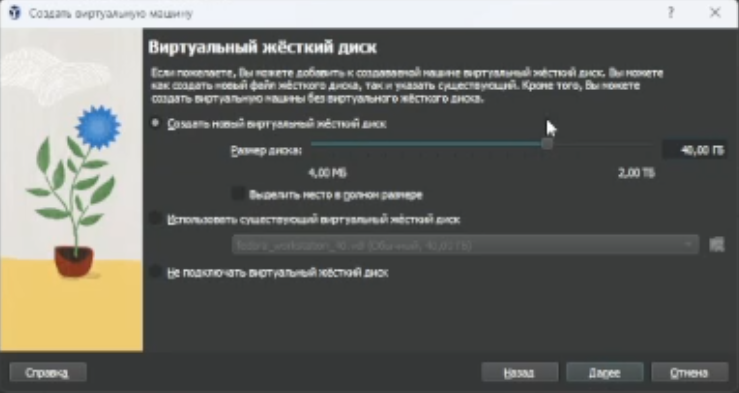

С помощью ключа -l выведем полную информацию о файлах 

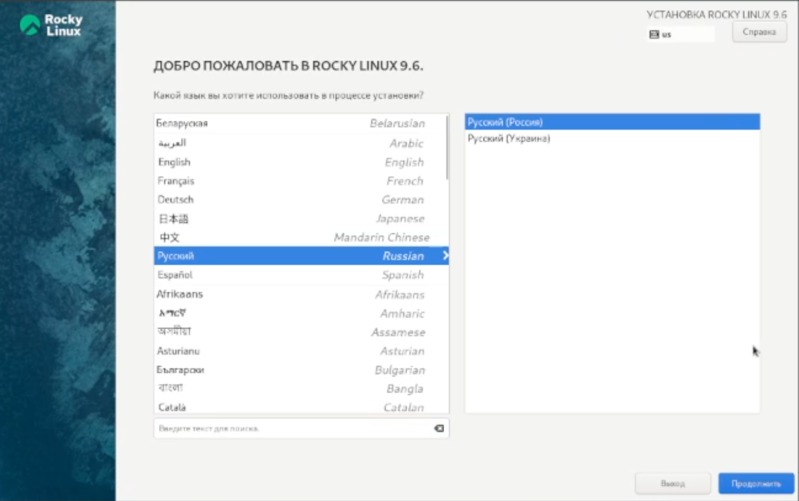

Теперь выведем типа элементов с помощью -F

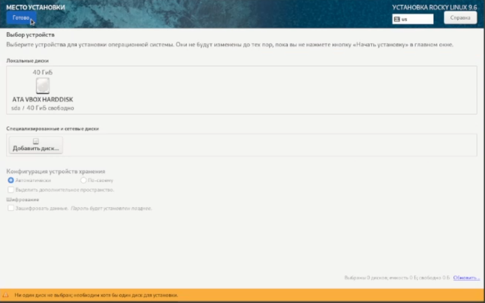

Посмотрим есть ли в каталоге /var/spool каталог cron

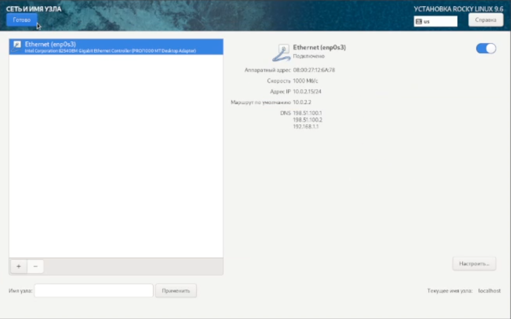

Перейдем в домашнюю директорию и выведем подробный список файлов и посмотрим кому они принадлежат (они пренадлежат пользователю - мне )

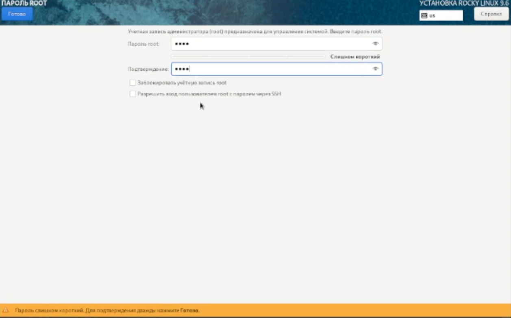

Создаем каталог newdir. Внутри него создадим каталог morefun. Создадим каталоги letters memos и misk одной коммандой пробуем удалить newdir с помощью rm  не получилось так как это каталог. Удалим его дочерний элемент с помощью  rmdir (удаление произошло успешно)

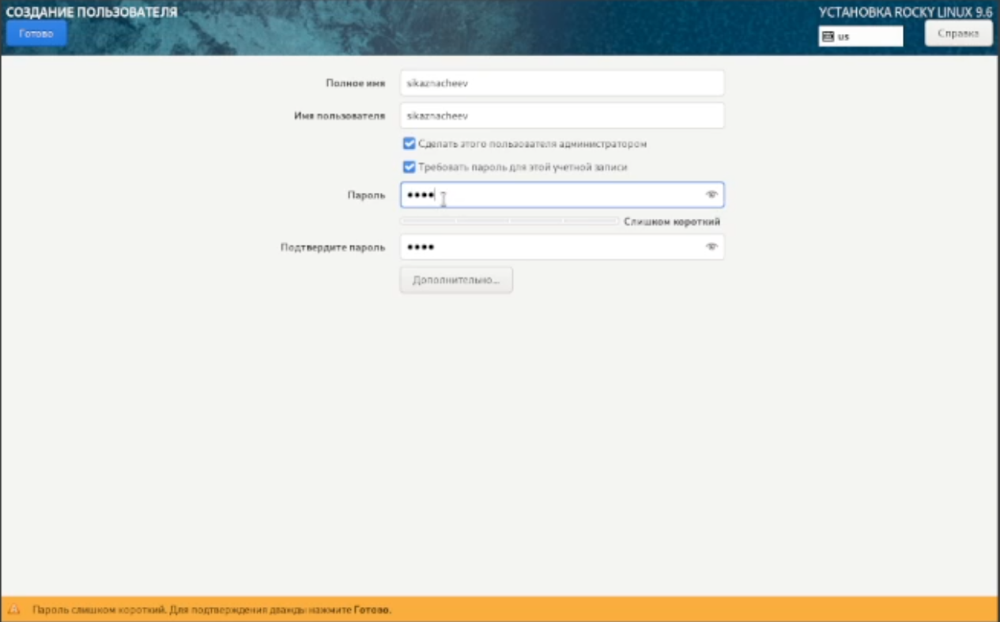

Посмотрим с помощью man какой ключ для вывода всех подкаталогов  это ключ -R

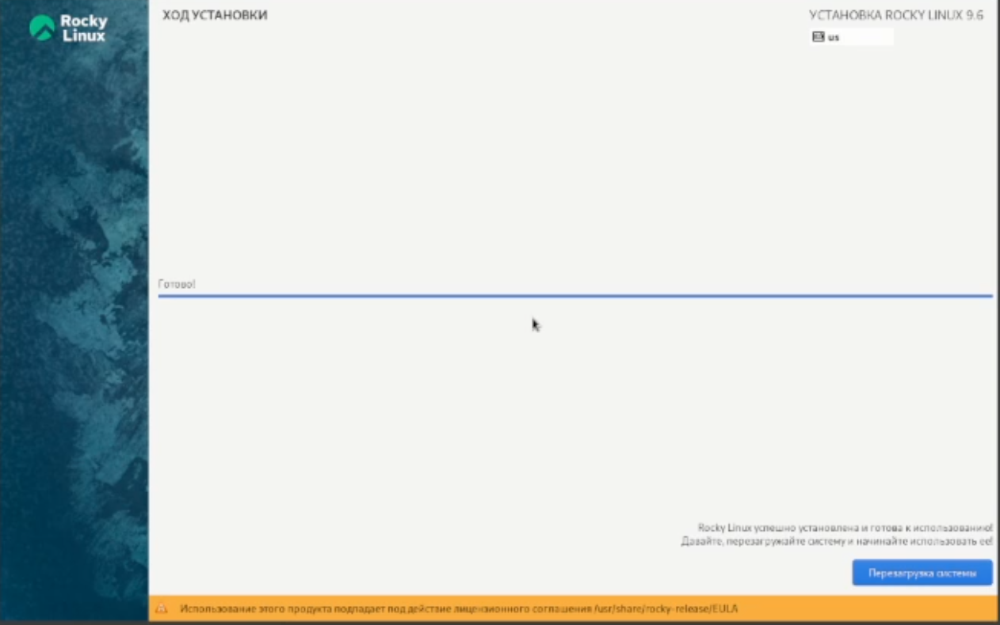

Посмотрим теперь ключ для вывода элементов по времени 

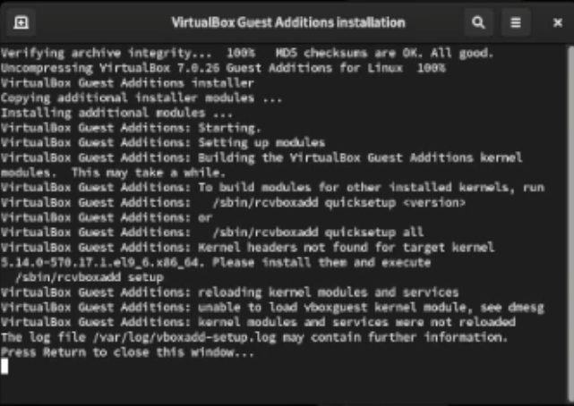

Посмотрим существующие ключи для cd основных 3 - p,l,e

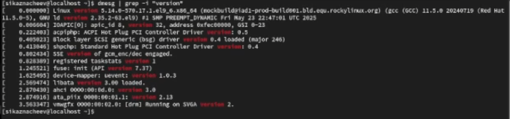

Посмотрим ключи для mkdir Основные -m(поставить права доступа),p(создать родительские каталоги ),v(подробно выводить каждое действие),z(поставить защиту в стандартный режим)

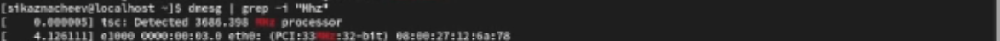

Посмотрим ключи для pwd основные будут l(использовать pwd из окружения ),p(избегать символьных ссылок)

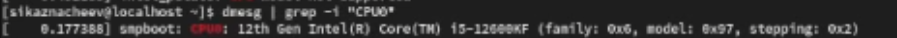

Посмотрим ключи для rmdir основные -p(удалить родительский каталог),v(подробно выводить каждое действие)

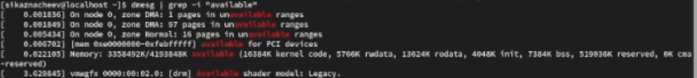

Посмотрим ключи для rm основные - f(принудительно удалять),i(спрашивать подтверждение)

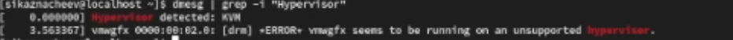

Выведем историю команд 

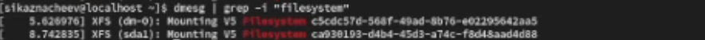

Примеры использования измененных команд 

# Выводы

В результате выполнения лабораторной работы были получены навыки работы с базовыми командами тарминала

# Ответы на контрольные вопросы 
1)Строка в которую мы можем писать команды для исполнения 
2)С помощью pwd пример-pwd загрузки
3)С помощью ls -F пример-ls -F/tmp
4)С помощью ls -al пример ls -al/var
5)При помощи rm и rmdir. Соответственно с помощью rm -R можZно удалять файлы так и каталоги пример  rm -R git-extended
6)С помощью команды history
7)!<номер_команды>:s/<что_меняем>/<на_что_меняем> пример !3:s/a/F
8)cd;mkdir;newdir;rm file.txt
9)Символы экранирования-специальные символы которые интерпретируются по другому пример !3:s/-a/newdir
10)Выводит также владельца дату права доступа и название 
11)Относительный путь-путь относительно текущего нахождения пример cd tmp и cd/tmp  разные команды по значению
12)С помощью  main
13)tab

