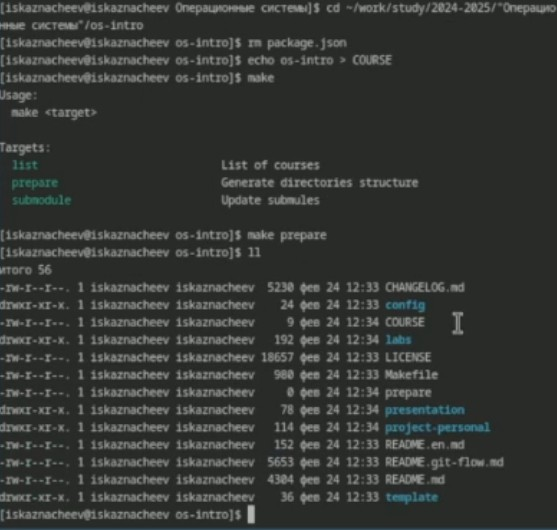

---
## Front matter
lang: ru-RU
title: Структура научной презентации
subtitle: Простейший шаблон
author:
  - Кулябов Д. С.
institute:
  - Российский университет дружбы народов, Москва, Россия
  - Объединённый институт ядерных исследований, Дубна, Россия
date: 01 января 1970

## i18n babel
babel-lang: russian
babel-otherlangs: english

## Formatting pdf
toc: false
toc-title: Содержание
slide_level: 2
aspectratio: 169
section-titles: true
theme: metropolis
header-includes:
 - \metroset{progressbar=frametitle,sectionpage=progressbar,numbering=fraction}
---

# Информация

## Докладчик

:::::::::::::: {.columns align=center}
::: {.column width="70%"}

  * Казначеев Сергей Ильич
  * Студент
  * Российский университет дружбы народов
  * [1132240693@pfur.ru]
:::
::: {.column width="30%"}
:::
::::::::::::::

# Цель
Изучить идеологию и применение средств контроля версий.
Освоить умения по работе с git.

## Задачи

Создать базовую конфигурацию для работы с git.
Создать ключ SSH.Создать ключ PGP.
Настроить подписи git.
Зарегистрироваться на Github.
Создать локальный каталог для выполнения заданий по предмету.

## Установка Git

Для начала установим Git

## Установка gh

Теперь установим gh

## Настройки git

Далее задаем имя владельца репозитория 

## Настройки git
Далее задаем почту владельца git

## Настройки git

Далее настроим котировку UTF-8 в выводе сообщения git

## Настройки git

Зададим имя начальной ветки настроим параметры autocrlf и safecrlf

## Создание ключа ssh

Создадим ключ RSA размером 4096 бит 

## Создание ключа ssh

Теперь создаем ключ по алгоритму ed22519

## Создание ключа gpg

Теперь создаем gpg, выбираем из предложенных вариантов первый тим(тип RSA and RSA),размер 4096 бит  и делаем срок ключа неограниченным 

## Создание ключа gpg

После нас просят ввести свои данные. Мы вводим имя и адрес электронной почты. После этого соглашаемся с генерацией ключа 

## Добавляем GPG ключ на Github

Далее выводим список ключей gpg

## Добавляем GPG ключ на Github

Копируем наш ключ в буфер обмена 

## Добавляем GPG ключ на Github

Вставляем ключ на Github и задаем ему имя 

## Настройка автоматических подписей коммитов git

Теперь произведем автоматическую настройку подписей 

## Настройка gh

После нам нужно авторизироватся в  github с помощью gh. Мы выбираем сайт для авторизации(Github),после выбираем 
предпочитаемый протокол (SSH), публичный ключ SSH ключ (id_rsa.pub) и имя для ключа sway. В качестве способа авторизации выбираем авторизацию через браузер 

## Создание репозитория курса на основе шаблона 

Теперь создаем рабочую директорию курса и переходим в неё

## Создание репозитория курса на основе шаблона 

Создаем репозиторий для лабораторных работ из шаблона

## Создание репозитория курса на основе шаблона 

И клонируем его к себе на компьютер 

## Настройка каталога курса 

Переходим в него с помощью cd и удаляем файл(package.json) и создаем необходимые каталоги записав в файл COURSE
строку echo os-intro и прописываем make prepare для того, чтобы нужные нам каталоги создались 

## Настройка каталога курса 

Теперь добавляем нашу папку для отправки 

## Настройка каталога курса 

Делаем коммит в котором указываем что мы сделали структуру курса 

## Настройка каталога курса 

И отправляем файлы на Github с помощью команды push

## Вывод

Я изучил идеологию и применение средств контроля версий и освоил умения по работе с git 

