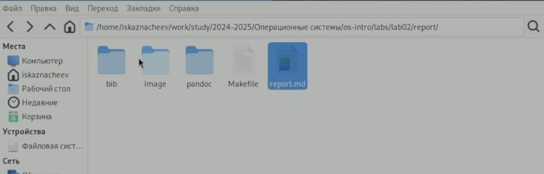
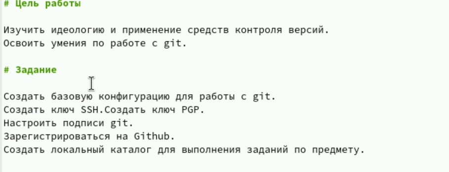
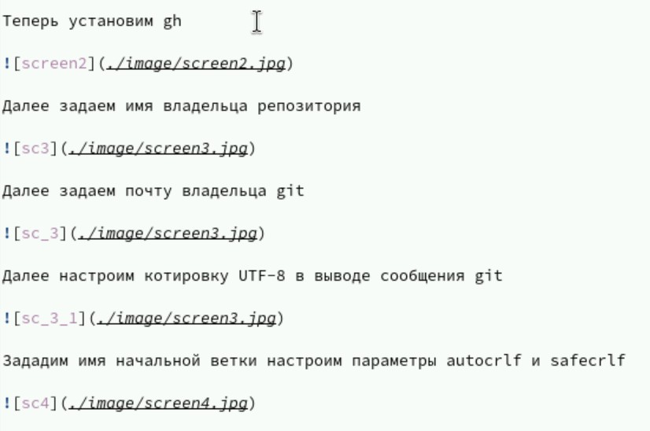

---
## Front matter
lang: ru-RU
title: Структура научной презентации
subtitle: Простейший шаблон
author:
  - Кулябов Д. С.
institute:
  - Российский университет дружбы народов, Москва, Россия
  - Объединённый институт ядерных исследований, Дубна, Россия
date: 01 января 1970

## i18n babel
babel-lang: russian
babel-otherlangs: english

## Formatting pdf
toc: false
toc-title: Содержание
slide_level: 2
aspectratio: 169
section-titles: true
theme: metropolis
header-includes:
 - \metroset{progressbar=frametitle,sectionpage=progressbar,numbering=fraction}
---

# Информация

## Докладчик

:::::::::::::: {.columns align=center}
::: {.column width="70%"}

  * Казначеев Сергей Ильич
  * Студент
  * Российский университет дружбы народов
  * [1132240693@pfur.ru]
:::
::: {.column width="30%"}

:::
::::::::::::::

## Цель 

Научиться оформлять отчёты с помощью легковесного языка разметки Markdown.

## Задачи

Сделайте отчёт по предыдущей лабораторной работе в формате Markdown.
В качестве отчёта просьба предоставить отчёты в 3 форматах: pdf, docx и md (в архиве,
поскольку он должен содержать скриншоты, Makefile и т.д.)

## Открытие файла для отчета лабораторной работы
 
Для начала откроем файл отчета "report.md"

## Написание титульного листа

Поменяем титульный лист, указав автора отчета по лабораторной работе 

## Написание отчета 

Копируем тест из предыдущего сделанного отчета по лабораторной работе №3

## Вывод

Я научился оформлять отчёты с помощью легковесного языка разметки Markdown.

:::

