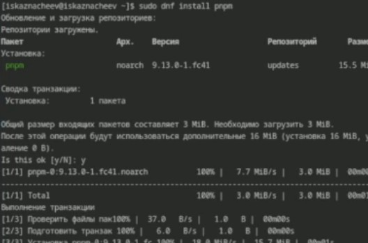
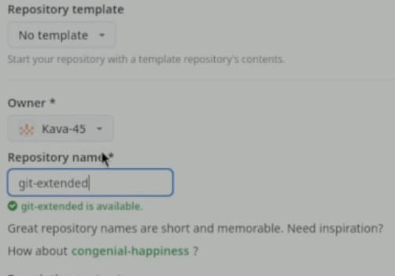
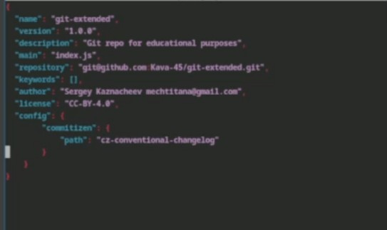
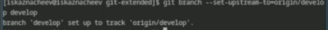
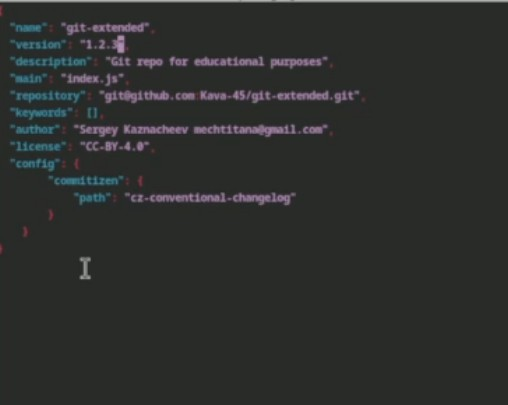
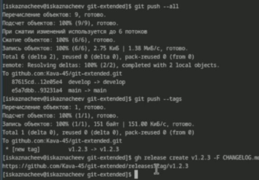

---
## Front matter
lang: ru-RU
title: Структура научной презентации
subtitle: Простейший шаблон
author:
  - Кулябов Д. С.
institute:
  - Российский университет дружбы народов, Москва, Россия
  - Объединённый институт ядерных исследований, Дубна, Россия
date: 01 января 1970

## i18n babel
babel-lang: russian
babel-otherlangs: english

## Formatting pdf
toc: false
toc-title: Содержание
slide_level: 2
aspectratio: 169
section-titles: true
theme: metropolis
header-includes:
 - \metroset{progressbar=frametitle,sectionpage=progressbar,numbering=fraction}
---

# Информация

## Докладчик

:::::::::::::: {.columns align=center}
::: {.column width="70%"}

  * Казначеев Сергей Ильич
  * Студент
  * Российский университет дружбы народов
  * [1132240693@pfur.ru]

:::
::: {.column width="30%"}

:::
::::::::::::::

## Цель 

Получение навыков правильной работы с репозиториями git.

## Задачи

Выполнить работу для тестового репозитория.
Преобразовать рабочий репозиторий в репозиторий с git-flow и conventional commits.

## Установка ПО

Для начала подключим репозиторий из которого можно скачать gitflow

## Установка ПО

После установим gitflow

## Установка ПО

Теперь установим Nodejs

## Установка ПО

Установим pnpm

## Установка ПО

Запустим pnpm

## Установка ПО

Теперь установим с помощью него Commitizien

## Настройка репозитория 

Создаем тестовый репозиторий git-extended

## Настройка репозитория 

И клонируем его себе на компьютер 

## Настройка репозитория 

Создадим какой нибудь файл и проиндексируем его с помощью git add сделав при этом commit

## Настройка репозитория 

Теперь добавим ветку 

## Настройка репозитория 

Теперь обратно запушим на github

## Cоздание коммитов 

Теперь проинициализируем pnpm

## Cоздание коммитов 

После инициальзации создается файл packege.json который меняем следующим образом 

## Cоздание коммитов 

Делаем коммит с помощью cz

## Использование gitflow

Проинициализируем gitflow. Укажем название веток и префикс для версий 

## Использование gitflow

Выведем список веток и убедимся, что мы находимся в develop, и запушим изменения на сервер 

## Использование gitflow

Переключимся на ветку develop после чего создадим ветку релиза где создадим changelog

## Использование gitflow

Проиндексируем changelog и сделаем коммит 

##  Использование gitflow

Теперь сольем ветку relaese с веткой changelog

##  Использование gitflow

Загружаем данные на github

##  Использование gitflow

Создаем релиз из changelog'a

## Работа с релизами 

Создаем ветку feature и сразу сливаем ее с develop

## Работа с релизами 

Создаем ветку релиза

## Работа с релизами 

Меняем версию в packege.json

## Работа с релизами 

Создаем ветку журнал изменений, проиндексируем его и сольем ветку с ним в ветку develop

## Работа с релизами 

Загрузим изменения на гитхаб и создадим релиз 

## Вывод

Я получил правильные навыки работы, с репозиториями git

