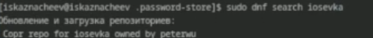

---
## Front matter
lang: ru-RU
title: Структура научной презентации
subtitle: Простейший шаблон
author:
  - Кулябов Д. С.
institute:
  - Российский университет дружбы народов, Москва, Россия
  - Объединённый институт ядерных исследований, Дубна, Россия
date: 01 января 1970

## i18n babel
babel-lang: russian
babel-otherlangs: english

## Formatting pdf
toc: false
toc-title: Содержание
slide_level: 2
aspectratio: 169
section-titles: true
theme: metropolis
header-includes:
 - \metroset{progressbar=frametitle,sectionpage=progressbar,numbering=fraction}
---

# Информация

## Докладчик

:::::::::::::: {.columns align=center}
::: {.column width="70%"}

  * Казначеев Сергей Ильич
  * Студент
  * Российский университет дружбы народов
  * [1132240693@pfur.ru]
:::
::: {.column width="30%"}

:::
::::::::::::::
## Цель 

Научится пользоватся pass и chezmoi

## Задачи 

Настроить OC  синхронизируя ее с данной
Научится использовать программы для управления паролями

## Установка программ 

Для начала необходимо установить pass и pass-out

## Цели и задачи

Установим gopass

## Работа с pass

Выведем список pgp  ключей

## Работа с pass

Проинициализируем pass, указав свой email

## Работа с pass

Проинициализируем репозиторий с git  для pass

## Работа с pass

Создадим репозиторий pass

## Работа с pass

Пробуем получить данные 

## Работа с pass

Но не получаем так как репозиторий пуст. Выложим изменения на Github

## Работа с pass

Теперь снова пробуем получить данные 

## Работа с pass

Сделаем пустой коммит и выложим его 

## Работа с pass

Проверим статус pass репозитория 

##  Работа с pass

Подключим репозиторий для скачивания browserpass

## Работа с pass

установим browserpass

## Работа с pass

и установим его в браузере 

## Работа с pass

Создадим файл с паролем 

## Установака дополнительного ПО 

И установим дополнительные пакеты 

## Установка шрифтов 

Подключим репозиторий для скачивания шрифтов 

## Установка шрифтов 

Найдем шрифты 

## Установка шрифтов 

И установим

## Установка chezmoi

Установка chezmoi

## Настройка chezmoi

Создадим репозиторий из шаблона

## Настройка chezmoi

Проинициализируем chezmoi, указав только что созданные репозиторий

## Работа chezmoi

Посмотрим на изменения 

## Работа chezmoi

И согласимся с ними

## Работа с chezmoi на второй машине 

Проинициализируем chezmoi на второй машине 

## Работа с chezmoi на второй машине 

Посмотрим изменения 

## Работа с chezmoi на второй машине 

И согласимся с ними 

## Работа с chezmoi 

Извлечем изменения из репозитория 

## Работа с chezmoi 

И отредактируем конфигурационный файл чтобы автоматически фиксировать изменения в исходный каталог в репозиторий 

## Вывод

В результате я научился пользоватся pass и chezmoi

