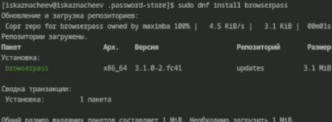

---
## Front matter
title: "Лабораторная работа №5"
subtitle: "Отчет"
author: "Казанчеев Сергей Ильич"

## Generic otions
lang: ru-RU
toc-title: "Содержание"

## Bibliography
bibliography: bib/cite.bib
csl: pandoc/csl/gost-r-7-0-5-2008-numeric.csl

## Pdf output format
toc: true # Table of contents
toc-depth: 2
lof: true # List of figures
lot: true # List of tables
fontsize: 12pt
linestretch: 1.5
papersize: a4
documentclass: scrreprt
## I18n polyglossia
polyglossia-lang:
  name: russian
  options:
	- spelling=modern
	- babelshorthands=true
polyglossia-otherlangs:
  name: english
## I18n babel
babel-lang: russian
babel-otherlangs: english
## Fonts
mainfont: IBM Plex Serif
romanfont: IBM Plex Serif
sansfont: IBM Plex Sans
monofont: IBM Plex Mono
mathfont: STIX Two Math
mainfontoptions: Ligatures=Common,Ligatures=TeX,Scale=0.94
romanfontoptions: Ligatures=Common,Ligatures=TeX,Scale=0.94
sansfontoptions: Ligatures=Common,Ligatures=TeX,Scale=MatchLowercase,Scale=0.94
monofontoptions: Scale=MatchLowercase,Scale=0.94,FakeStretch=0.9
mathfontoptions:
## Biblatex
biblatex: true
biblio-style: "gost-numeric"
biblatexoptions:
  - parentracker=true
  - backend=biber
  - hyperref=auto
  - language=auto
  - autolang=other*
  - citestyle=gost-numeric
## Pandoc-crossref LaTeX customization
figureTitle: "Рис."
tableTitle: "Таблица"
listingTitle: "Листинг"
lofTitle: "Список иллюстраций"
lotTitle: "Список таблиц"
lolTitle: "Листинги"
## Misc options
indent: true
header-includes:
  - \usepackage{indentfirst}
  - \usepackage{float} # keep figures where there are in the text
  - \floatplacement{figure}{H} # keep figures where there are in the text
---

# Цель работы

Научится пользоватся pass и chezmoi

# Задание

Настроить OC  синхронизируя ее с данной
Научится использовать программы для управления паролями

# Выполнение лабораторной работы

Для начала необходимо установить pass и pass-out

Установим gopass

Выведем список pgp  ключей

Проинициализируем pass, указав свой email

Проинициализируем репозиторий с git  для pass

Создадим репозиторий pass

Пробуем получить данные 

Но не получаем так как репозиторий пуст. Выложим изменения на Github

Теперь снова пробуем получить данные 

Сделаем пустой коммит и выложим его 

Проверим статус pass репозитория 

Подключим репозиторий для скачивания browserpass

установим browserpass

и установим его в браузере 

Создадим файл с паролем 

И установим дополнительные пакеты 

Подключим репозиторий для скачивания шрифтов 

 
Найдем шрифты 

И установим

Установка chezmoi

Создадим репозиторий из шаблона

Проинициализируем chezmoi, указав только что созданные репозиторий

Посмотрим на изменения 

И согласимся с ними

Проинициализируем chezmoi на второй машине 

Посмотрим изменения 

И согласимся с ними 

Извлечем изменения из репозитория 

И отредактируем конфигурационный файл чтобы автоматически фиксировать изменения в исходный каталог в репозиторий 

# Выводы

В результате я научился пользоватся pass и chezmoi

