---
## Front matter
lang: ru-RU
title: Структура научной презентации
subtitle: Простейший шаблон
author:
  - Кулябов Д. С.
institute:
  - Российский университет дружбы народов, Москва, Россия
  - Объединённый институт ядерных исследований, Дубна, Россия
date: 01 января 1970

## i18n babel
babel-lang: russian
babel-otherlangs: english

## Formatting pdf
toc: false
toc-title: Содержание
slide_level: 2
aspectratio: 169
section-titles: true
theme: metropolis
header-includes:
 - \metroset{progressbar=frametitle,sectionpage=progressbar,numbering=fraction}
---

# Информация

## Докладчик

:::::::::::::: {.columns align=center}
::: {.column width="70%"}

  * Казначеев Сергей Ильич
  * Студент
  * Российский университет дружбы народов
  * [1132240693@pfur.ru]
:::
::: {.column width="30%"}

:::
::::::::::::::
## Цель

Приобрести практические навыки взаимодействия пользователя с системой посредством командной строки 

## Задачи 
1 Определите полное имя вашего домашнего каталога. Далее относительно этого ката-
лога будут выполняться последующие упражнения.
2 Выполните следующие действия:
 2.1. Перейдите в каталог /tmp.
 2.2. Выведите на экран содержимое каталога /tmp. Для    этого используйте команду ls
 с различными опциями. Поясните разницу в выводимой на экран информации.
 2.3. Определите, есть ли в каталоге /var/spool подкаталог с именем cron?
 2.4. Перейдите в Ваш домашний каталог и выведите на   экран его содержимое. Опре-
 делите, кто является владельцем файлов и подкаталогов?

## Задачи 

Выполните следующие действия:
 3.1. В домашнем каталоге создайте новый каталог с именем newdir.
 3.2. В каталоге ~/newdir создайте новый каталог с именем morefun.
 3.3. В домашнем каталоге создайте одной командой три новых каталога с именами
letters, memos, misk. Затем удалите эти каталоги одной командой.
 3.4. Попробуйте удалить ранее созданный каталог ~/newdir командой rm. Проверьте,
был ли каталог удалён.
 3.5. Удалите каталог ~/newdir/morefun из домашнего каталога. Проверьте, был ли
каталог удалён.

## Задачи 

4 С помощью команды man определите, какую опцию команды ls нужно использо-
вать для просмотра содержимое не только указанного каталога, но и подкаталогов,
входящих в него.
5 С помощью команды man определите набор опций команды ls, позволяющий отсорти-
ровать по времени последнего изменения выводимый список содержимого каталога
с развёрнутым описанием файлов.
6 Используйте команду man для просмотра описания следующих команд: cd, pwd, mkdir,
rmdir, rm. Поясните основные опции этих команд.
7 Используя информацию, полученную при помощи команды history, выполните мо-
дификацию и исполнение нескольких команд из буфера команд.
## Определение имени каталога 

Для начала посмотрим полный путь для нашего каталога 

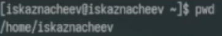

## Переходим в /tmp

Далее перейдем в каталог /tmp и посмотрим его 

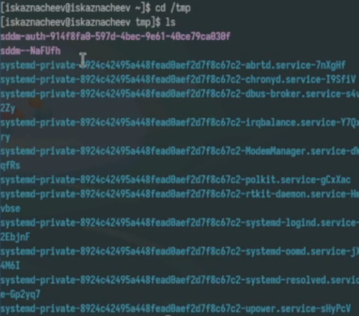

## ls

С помощью ключа -а выведем и дополнительные файлы 

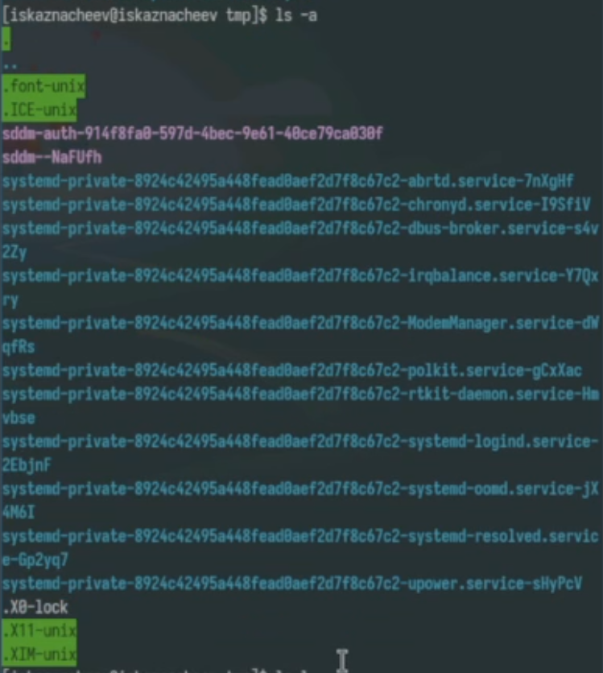

## ls

С помощью ключа -l выведем полную информацию о файлах 

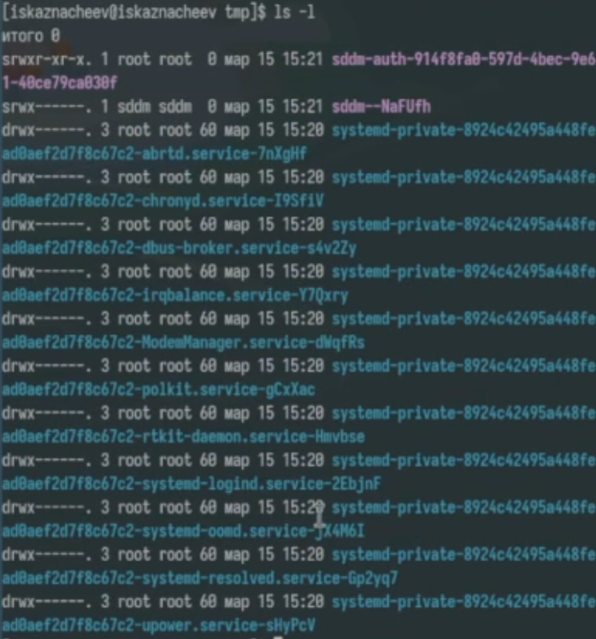

## ls

Теперь выведем типа элементов с помощью -F

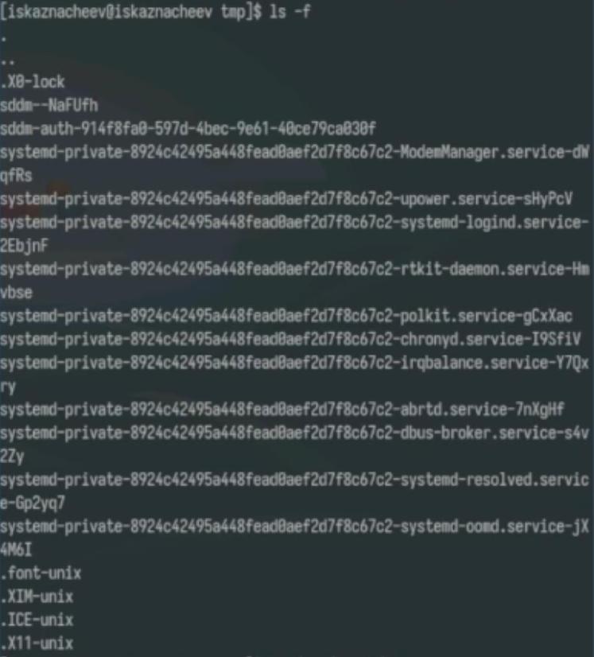

## Содержание /var/spool

Посмотрим есть ли в каталоге /var/spool каталог cron

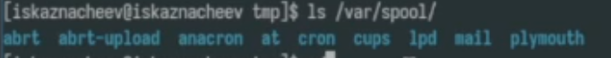

## Подробный просмотр содержимого 

Перейдем в домашнюю директорию и выведем подробный список файлов и посмотрим кому они принадлежат (они пренадлежат пользователю - мне )

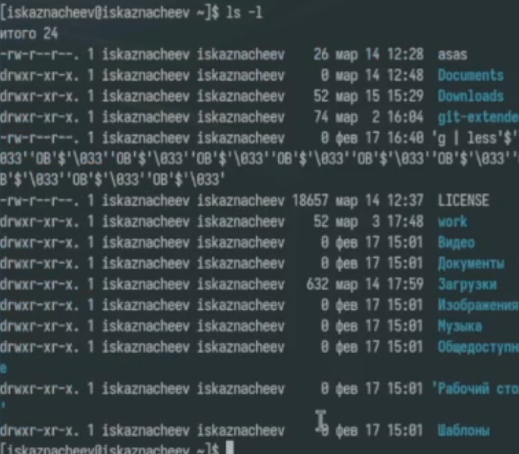

## Создание и удаление директории

Создаем каталог newdir. Внутри него создадим каталог morefun. Создадим каталоги letters memos и misk одной коммандой пробуем удалить newdir с помощью rm  не получилось так как это каталог. Удалим его дочерний элемент с помощью  rmdir (удаление произошло успешно)

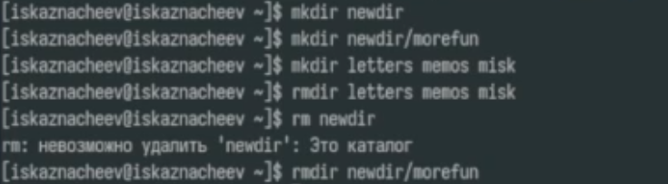

## Ключи 

Посмотрим с помощью man какой ключ для вывода всех подкаталогов  это ключ -R

## Ключи 

Посмотрим теперь ключ для вывода элементов по времени 

## Ключи и man

Посмотрим существующие ключи для cd основных 3 - p,l,e

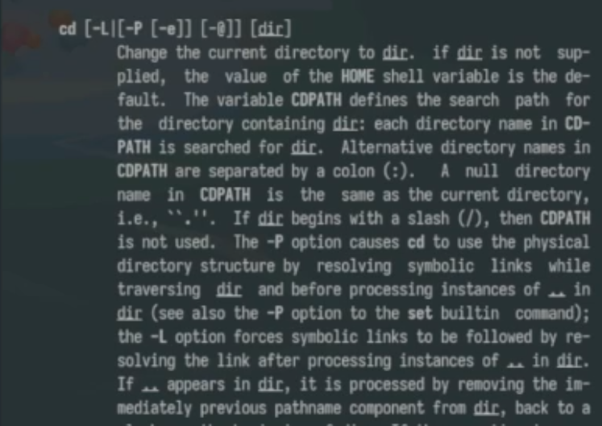

## Ключи и man

Посмотрим ключи для mkdir Основные -m(поставить права доступа),p(создать родительские каталоги ),v(подробно выводить каждое действие),z(поставить защиту в стандартный режим)

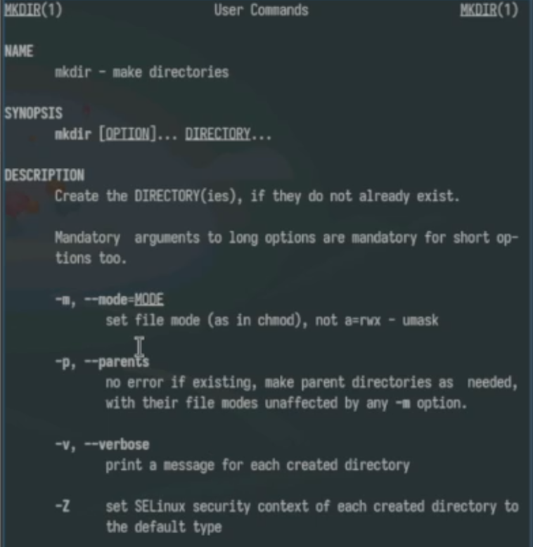

## Ключи и man

Посмотрим ключи для pwd основные будут l(использовать pwd из окружения ),p(избегать символьных ссылок)

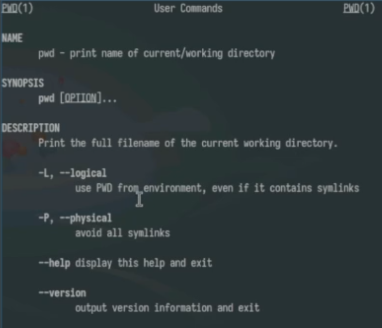

## Ключи и man

Посмотрим ключи для rmdir основные -p(удалить родительский каталог),v(подробно выводить каждое действие)

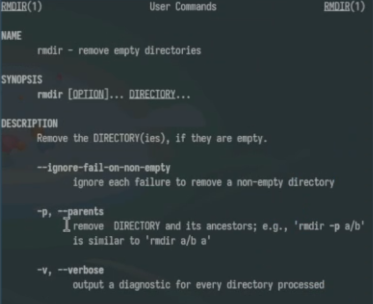

## Ключи и man

Посмотрим ключи для rm основные - f(принудительно удалять),i(спрашивать подтверждение)

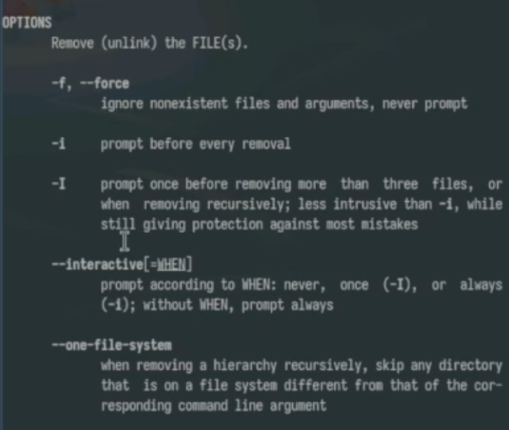

## history

Выведем историю команд 

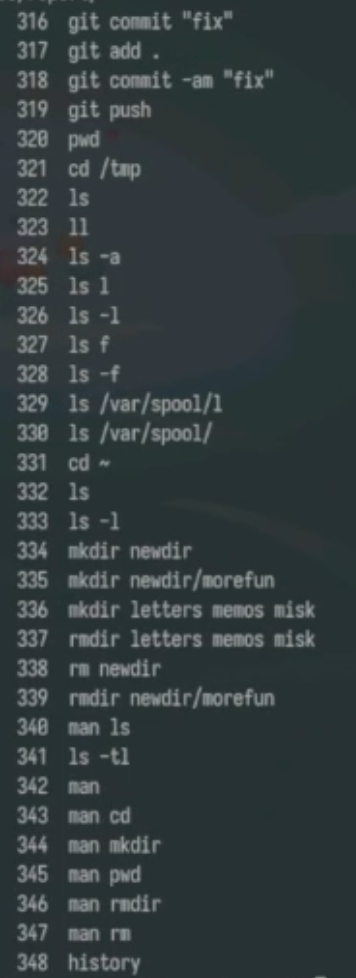

## history

Примеры использования измененных команд 

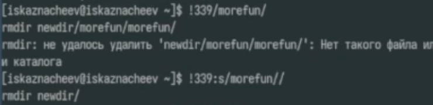

## history

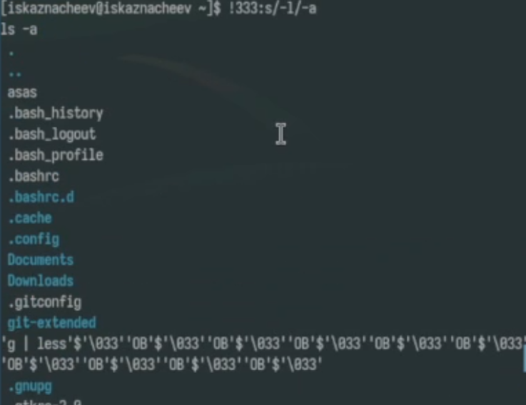

## history

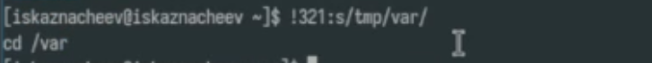

## Вывод

В результате выполнения лабораторной работы были получены навыки работы с базовыми командами тарминала

