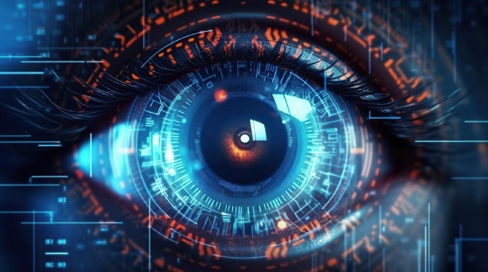

---
## Front matter
lang: ru-RU
title: Схема аутентификации пользователей с помощью логинов и паролей.
subtitle: Простейший шаблон
author:
  - Казначеев С. И.
institute:
  - Российский университет дружбы народов, Москва, Россия
## i18n babel
babel-lang: russian
babel-otherlangs: english

## Formatting pdf
toc: false
toc-title: Содержание
slide_level: 2
aspectratio: 169
section-titles: true
theme: metropolis
header-includes:
 - \metroset{progressbar=frametitle,sectionpage=progressbar,numbering=fraction}
---

# Информация

## Докладчик

:::::::::::::: {.columns align=center}
::: {.column width="70%"}

  * Казначеев Сергей Ильич
  * Студент
  * Российский университет дружбы народов
  * [1132240693@pfur.ru]
:::
::: {.column width="30%"}

:::
::::::::::::::

# Вводная часть

## Введение

- Аутентификация — фундамент информационной безопасности
- От простых паролей к многофакторным системам 
- Особенности российских разработок

## Объект и предмет исследования

1. 1960-1970-е: Эпоха мейнфреймов

БЭСМ-6 с ОС "Диспетчер-68"

Примитивные парольные схемы

Хранение в защищённых областях памяти

Контроль доступа к вычислительным задачам

2. 1970-1980-е: Мини-ЭВМ

Системы РТ-11 и ДИАЛ

Первое файловое хранение учётных записей

Базовое шифрование паролей

Разграничение прав доступа к устройствам

3. 1980-1990-е: UNIX-революция

ОС ДЕМОС (адаптация BSD UNIX)

Классическая модель /etc/passwd

Поддержка кириллицы в логинах

Механизмы блокировки при bruteforce

4. 2000-е → настоящее время: Современные ОС

Astra Linux / ALT Linux

ГОСТ-шифрование паролей

Модульная PAM-аутентификация

Многофакторные методы (токены, 2FA)

## Ранние советские ОС (1960-1970)

Характеристики

- Элементарные парольные схемы

- Хранение в защищенных областях памяти

- Пример: ОС "Диспетчер-68" для БЭСМ-6

## Эпоха мини-ЭВМ (1970-1980)

Нововведения

- Файловое хранение учетных записей

- Базовое шифрование паролей

- Разграничение доступа к устройствам

## UNIX-подобные системы (1980-1990)

Особенности ДЕМОС

- Адаптация /etc/passwd

- Поддержка кириллицы

- Механизмы блокировки при bruteforce

## Современные угрозы и защита

Основные вызовы безопасности

- Атаки методом перебора (Bruteforce)

Автоматизированные системы подбора паролей

Защита лимиты попыток входа, CAPTCHA

- Фишинг и социальная инженерия

Кража учетных данных через поддельные формы

Защита двухфакторная аутентификация

- Уязвимости в компонентах

Эксплуатация слабостей PAM-модулей

Защита регулярные обновления и аудит

## Современные угрозы и защита

Защитные механизмы

- Жесткие политики паролей

- Многофакторная аутентификация

- Непрерывный мониторинг

	
## Будущее

Что нас ждет?

- Распознавание лиц и голоса

- "Невидимая" аутентификация

- Квантовая криптография

## Итоги

Что важно запомнить?

- Постоянное развитие методов

- Соответствие мировым стандартам

- Уникальные российские решения
